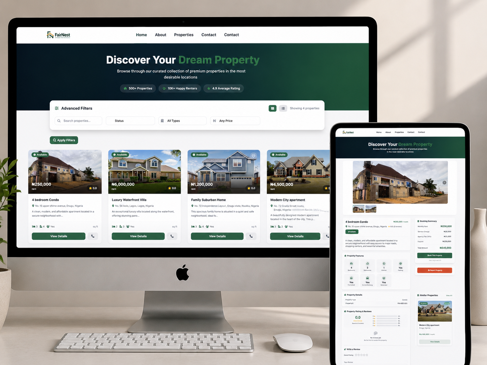
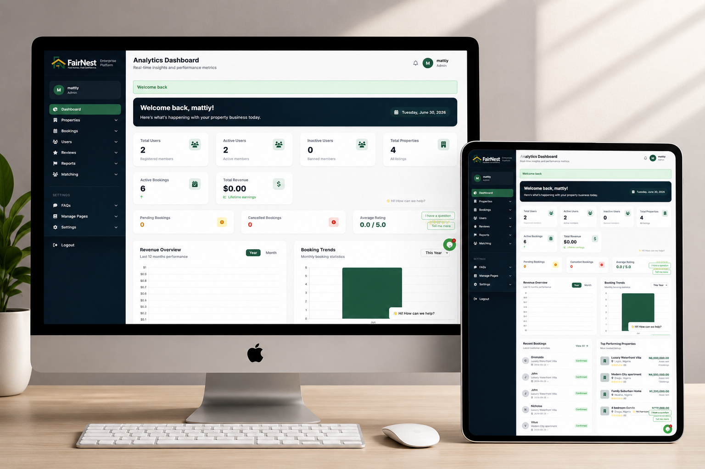
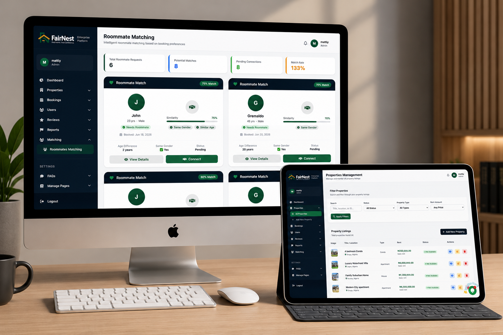

# 🏡 Property Listing & Roommate Matching Platform

A web-based property listing platform that allows users to search for rental properties, express interest, and optionally find roommates. The system includes a powerful admin backend for managing users, properties, reviews, and role-based access control.

---

## Preview

<table>
  <tr>
    <td>
      
    </td>
    <td>
      
    </td>
  </tr>
  <tr>
    <td>
      
    </td>
    <td>
      
    </td>
  </tr>
</table>

## Live Demo

https://fairnest.com.ng

## 🚀 Project Overview

This platform simplifies the rental discovery process by connecting property seekers, agents, and administrators in a structured ecosystem.

Users can:
- Search and browse rental properties
- View detailed property listings
- Express interest in properties
- Opt-in for roommate matching

Agents can:
- Manage assigned property listings
- Interact with property-related data

Admins can:
- Manage users, agents, and properties
- Moderate reviews
- Handle roommate matching logic
- Control system-wide permissions via RBAC

---

## 🧠 Key Features

### 👤 User Features
- Property search and filtering
- View detailed property listings
- Express interest in properties
- Roommate preference selection

### 🏠 Property Features
- Property listing management
- Property categorization
- Detailed property information (price, location, description)
- Status tracking (available, rented, etc.)

### 🤝 Roommate Matching
- Users can opt-in for roommate matching
- System matches users based on preferences
- Admin-managed pairing system

### ⭐ Reviews System
- Users can submit property reviews
- Admin moderation of reviews
- Property review visibility management

---

## 🛠 Admin Features

- 👥 **User Management**
  - Create, update, deactivate users
  - Manage user roles and status

- 🏠 **Property Management**
  - Create and manage property listings
  - Approve, update, and remove properties
  - Maintain listing quality

- ⭐ **Review Management**
  - Moderate user reviews
  - Manage property reviews
  - Ensure content quality and trust

- 🤝 **Roommate Matching Management**
  - Match users looking for roommates
  - Manage and approve roommate pairings
  - Handle compatibility logic

- 🔐 **Role-Based Access Control (RBAC)**
  - Roles: Admin, Agent, User
  - Granular permission system
  - Secure access control for all modules

---


flowchart LR

User --> Login
Login --> AuthCheck{Authenticated?}

AuthCheck -->|Yes| RoleCheck{User Role}

RoleCheck --> Admin[Admin Access]
RoleCheck --> Agent[Agent Access]
RoleCheck --> UserAccess[User Access]

AuthCheck -->|No| Denied[Access Denied]

## 🧱 Tech Stack

### Backend
- PHP (Laravel Framework)
- RESTful API architecture
- Service Layer pattern

### Database
- MySQL

### Authentication & Security
- Laravel Authentication
- Role-Based Access Control (RBAC)

### DevOps & Tools
- Docker
- Docker Compose

### Architecture
- MVC (Model-View-Controller)
- Modular service-based design

## ⚙️ Local Development Setup (Docker)

This project is containerized using Docker to ensure a consistent development environment across all systems.

---

## ⚙️ Local Development Setup (Docker)

This project is containerized using Docker to ensure a consistent development environment.

---

### 📋 Prerequisites

Ensure you have the following installed:

- Docker
- Docker Compose
- Git

---

### 🚀 Setup Steps

### 1. Clone the repository

```bash
git clone https://github.com/arohchidi/fairnest.git
cd fairnest
